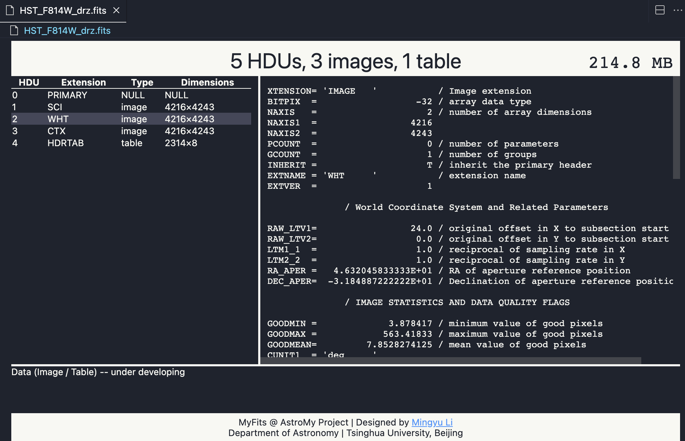

# MyFits: astromy-fits-vscode

MyFits is a Visual Studio Code extension to preview astronomical FITS files.

> Install: Search `MyFits` in the VSCode extension store.

## Features

- Inspect every HDU header inside FITS, PHA, PI, ARF, and related files.
- Render interactive previews of 2-D image extensions with zoom, stretch, and color-map controls inspired by JS9.
- Display searchable binary/ASCII table snippets (column units + row filtering) alongside keyword search within headers.
- Skip bulk pixel payloads automatically when files exceed the preview limit, while offering a manual “Load image anyway” action for huge datasets.

> This extension is still under active development; please share ideas or issues!

## Known Issues

- Files larger than ~2 GB load in header-only mode; image/table payloads are skipped with a warning to keep VS Code responsive.
- Variable-length or highly custom table descriptors are surfaced as `[unsupported]` cells in the preview.

## Release Notes

Please check the `CHANGELOG.md` for the release notes.
